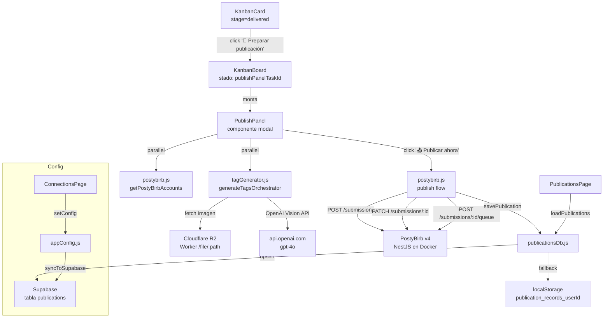

# Design Document — Artwork Publish Pipeline

## Overview

El **Artwork Publish Pipeline** agrega a la app de gestión de comisiones artísticas un flujo completo para publicar obras finales en múltiples plataformas artísticas simultáneamente. La integración se apoya en tres servicios externos: **PostyBirb v4** (corriendo en Docker local + Cloudflare Tunnel), **OpenAI Vision API** (para generación automática de tags e621), y **Cloudflare R2** (almacenamiento existente de imágenes).

El pipeline se activa desde las tarjetas Kanban en stage `delivered`. El artista hace clic en "📢 Preparar publicación", revisa/edita los tags y las plataformas destino en el `PublishPanel`, y con un clic en "📤 Publicar ahora" el sistema ejecuta las tres llamadas a la API de PostyBirb, registra el resultado como `Publication_Record` y lo muestra en la nueva página "Publicaciones".

### Objetivos de diseño

- **Mínima fricción**: el artista no necesita abrir PostyBirb manualmente ni escribir tags.
- **Resiliencia offline**: los registros de publicaciones se persisten en localStorage como fallback ante fallos de red.
- **Seguridad**: las API Keys nunca se exponen en URLs, logs ni respuestas.
- **Coherencia con el código existente**: todos los patrones (store, persistencia, UI) siguen las convenciones del proyecto.

---

## Architecture

El pipeline sigue la misma arquitectura en capas que el resto de la app: componentes React → lib (lógica de negocio) → store (persistencia). No se introduce ningún backend nuevo; toda la lógica corre en el cliente Vercel.



### Flujo de datos detallado

```
KanbanCard [stage=delivered]
  → click "📢 Preparar publicación"
  → KanbanBoard monta PublishPanel(taskId)
    → useEffect: generateTags(highResUrl) + getPostyBirbAccounts() [paralelo]
    → usuario revisa/edita tags, selecciona plataformas
    → click "📤 Publicar ahora"
      → fetch(highResUrl) → Blob               [timeout 30s]
      → POST /submissions (multipart)
      → PATCH /submissions/:id (tags + accountIds)
      → POST /submissions/:id/queue
      → savePublication(record)                [upsert Supabase + fallback LS]
      → mostrar "✅ Obra enviada" → cerrar panel (2s)
```

---

## Components and Interfaces

### Nuevos archivos

#### `src/lib/postybirb.js`

Cliente HTTP para la API de PostyBirb v4. Lee URL y API Key desde `getConfig()`.

```js
// Todas las funciones tienen timeout de 30s
getPostyBirbAccounts()           → Promise<Platform_Account[]>
createSubmission(file, title, description) → Promise<string>  // submissionId
updateSubmission(id, { tags, accountIds }) → Promise<void>
queueSubmission(id)              → Promise<void>
```

- Header `X-API-Key` incluido **solo si** `postybirbApiKey` está configurada.
- `Platform_Account = { id: string, website: string, name: string }` (forma del objeto devuelto por `/api/account`).
- Lanza un error con el mensaje extraído del body JSON (`error.message` o body completo) en cualquier respuesta no-2xx.

#### `src/lib/tagGenerator.js`

Módulo de generación de tags con OpenAI Vision. Función principal:

```js
generateTags(imageUrl)  → Promise<string[]>
```

**Lógica interna:**

1. Lee `openaiApiKey` de `getConfig()`. Si no está configurada → lanza `ConfigError`.
2. Llama a `https://api.openai.com/v1/chat/completions` con modelo `gpt-4o`, `max_tokens: 500`, y un prompt que solicita tags e621 en las categorías `species`, `character`, `artist`, `general`, `copyright`, `meta`.
3. Parsea la respuesta: extrae tags de texto libre (líneas o comas separadas).
4. Aplica `normalizeTag(tag)` a cada item: `tag.toLowerCase().replace(/\s+/g, '_')`.
5. Filtra vacíos y limita a 200 tags como máximo.
6. Timeout: 15s via `AbortController`.

```js
// Función pura exportada para testing
normalizeTag(s: string) → string
```

#### `src/lib/publicationsDb.js`

Capa de datos para `Publication_Record`. Sigue exactamente el patrón de `src/store/archiveDb.js`.

```js
savePublication(record)      → Promise<void>
loadPublications()           → Promise<Publication_Record[]>
clearPublicationsCache()     → void   // llamado en logout
```

**`savePublication` — lógica de persistencia:**

```js
// 1. Guardar inmediatamente en localStorage (synchronous)
localStorage[`publication_records_${userId}`] = JSON.stringify([...existing, record])

// 2. Intentar upsert Supabase
await supabase.from('publications').upsert({ ...record, user_id: userId })

// 3. Si falla: programar reintento cada 60s con setInterval
//    El interval se limpia tras éxito
```

**`loadPublications`:**

```js
// 1. Intentar Supabase
const { data } = await supabase.from('publications').select('*').eq('user_id', userId)
if (data) return data.map(mapRow)

// 2. Fallback localStorage
return JSON.parse(localStorage[`publication_records_${userId}`] ?? '[]')
```

**Schema `Publication_Record`:**

```ts
{
  id: string           // UUID v4
  taskId: string
  taskName: string
  imageUrl: string     // URL pública en R2
  platforms: string[]  // nombres de plataformas
  status: 'queued' | 'published' | 'error'
  errorMessage: string | null
  postybirbSubmissionId: string
  sentAt: string       // ISO-8601 UTC
  userId: string
}
```

#### `src/components/PublishPanel.jsx`

Modal overlay (`position: fixed`, z-index elevado). Props: `{ taskId, task, fields, onClose }`.

**Layout (dos columnas):**

```
┌─────────────────────────────────────────────────────┐
│  ✕                                           Título │
├─────────────────┬───────────────────────────────────┤
│                 │ Título (input)                    │
│            │ Descripción (textarea)            │
│ object-fit:     │ ─── Tags ──────────────────────── │
│ contain         │ [chip] [chip] [chip] + input       │
│ max-h: 400px    │ 🔄 Regenerar tags                 │
│                 │ ─── Plataformas ────────────────── │
│                 │ ☐ Twitter ☐ FurAffinity ☐ ...    │
│                 │ [barra de progreso 3 pasos]        │
│                 │ [📤 Publicar ahora]                │
└─────────────────┴───────────────────────────────────┘
```

**Ciclo de vida:**

```
onMount
  → identifyHighResAttachment(fields.attachments)
  → Promise.all([generateTags(url), getPostyBirbAccounts()])
  → setState({ tags, accounts, loadingTags: false, loadingAccounts: false })

onPublishClick
  → validate(title, selectedAccounts, tags)  // AC 4.1
  → setStep('uploading')
  → blob = await fetch(highResUrl)            // timeout 30s
  → setStep('submitting')
  → submissionId = await createSubmission(blob, title, description)
  → await updateSubmission(submissionId, { tags, accountIds })
  → setStep('queuing')
  → await queueSubmission(submissionId)
  → await savePublication({ id: uuid(), taskId, taskName, imageUrl, platforms, status: 'queued', ... })
  → showSuccess → setTimeout(onClose, 2000)
```

**Indicador de progreso:**

```
Paso 1: "⬆ Subiendo imagen..."
Paso 2: "⚙ Configurando publicación..."
Paso 3: "📬 Encolando en PostyBirb..."
```

**Gestión de tags (chips editables):**

- Agregar: campo de texto + Enter → `normalizeTag()` aplicado antes de insertar.
- Eliminar: botón ✕ en cada chip.
- Máximo 200 tags: si `tags.length >= 200`, el campo de entrada se deshabilita y muestra advertencia.
- Cambios persistidos en `fields.publishTags` vía `updateField(taskId, 'publishTags', tags)` en cada modificación.

#### `src/pages/PublicationsPage.jsx`

Página de historial. Lista de tarjetas con:

- Miniatura 60×60 (fallback: placeholder gris con `🖼`).
- Nombre de comisión, plataformas (chips), badge de estado, fecha `DD/MM/YYYY HH:mm` (locale del navegador).
- Si `status === 'error'`: muestra `errorMessage` debajo del nombre.
- Si `taskId` existe en `rawTasks`: botón "Ver en tablero" → navega a `/studio`.
- Si `taskId` no existe: botón deshabilitado con `title="La comisión ya no existe en el tablero."`.
- Empty state: "Aún no has enviado ninguna publicación a PostyBirb."
- Offline banner: "Mostrando datos locales — reconecta para sincronizar." si cargó desde localStorage.

### Modificaciones a archivos existentes

#### `src/App.jsx`

```js
// Agregar import
import PublicationsPage from './pages/PublicationsPage.jsx'

// En ROUTE_TO_PAGE
'/publications': 'publications'

// En PAGE_TO_ROUTE
publications: '/publications'

// En <Routes>
<Route path="/publications" element={<PublicationsPage />} />
```

#### `src/components/Sidebar.jsx`

Agregar al array `NAV_ITEMS`:

```js
{ id: 'publications', icon: '📣', label: 'Publicaciones' }
```

#### `src/components/KanbanBoard.jsx`

En el componente `KanbanBoard` (padre de las columnas):

```js
const [publishPanelTaskId, setPublishPanelTaskId] = useState(null)

// Pasar callback a KanbanCard a través de KanbanColumn:
onOpenPublishPanel={(taskId) => setPublishPanelTaskId(taskId)}

// Montar panel como sibling del board:
{publishPanelTaskId && (
  <PublishPanel
    taskId={publishPanelTaskId}
    task={getTask(publishPanelTaskId)}
    fields={getFields(publishPanelTaskId)}
    onClose={() => setPublishPanelTaskId(null)}
  />
)}
```

En `KanbanCard`, después de las pills, agregar la sección de publicación:

```jsx
{fields.stage === 'delivered' && (
  <div className="publish-section" onClick={e => e.stopPropagation()}>
    <button
      className="publish-btn"
      disabled={!(fields.attachments || []).some(a => a.type?.startsWith('image/'))}
      title={
        (fields.attachments || []).some(a => a.type?.startsWith('image/'))
          ? 'Preparar publicación en PostyBirb'
          : 'Adjunta la imagen final antes de publicar'
      }
      onClick={() => onOpenPublishPanel(task.id)}
    >
      📢 Preparar publicación
    </button>
  </div>
)}
```

#### `src/store/appConfig.js`

Agregar a `DEFAULTS`:

```js
postybirbUrl: '',
postybirbApiKey: '',
openaiApiKey: '',
```

Agregar a `syncToSupabase`:

```js
postybirb_url: _config.postybirbUrl,
postybirb_api_key: _config.postybirbApiKey,
openai_api_key: _config.openaiApiKey,
```

#### `src/pages/ConnectionsPage.jsx`

Agregar dos secciones al `conn-grid`:

**Sección PostyBirb:**

- Input URL (`type="text"`, validación `https://` en `handleSavePostyBirb`).
- Input API Key (`type="password"`, opcional).
- Botón "💾 Guardar" → `setConfig('postybirbUrl', url)` + `setConfig('postybirbApiKey', key)`.
- Botón "🧪 Probar conexión" → `getPostyBirbAccounts()`, muestra "✅ PostyBirb conectado — N plataformas disponibles" o "❌ No se pudo conectar. Verifica que el Cloudflare Tunnel esté activo y la URL sea correcta."
- Link "¿Cómo configurar el Cloudflare Tunnel?" → `https://developers.cloudflare.com/cloudflare-one/connections/connect-networks/`

**Sección OpenAI:**

- Input API Key (`type="password"`).
- Botón "💾 Guardar" → `setConfig('openaiApiKey', key)`.

---

## Data Models

### Tabla Supabase: `publications`

```sql
CREATE TABLE publications (
  id                      UUID PRIMARY KEY,
  user_id                 UUID NOT NULL REFERENCES auth.users(id),
  task_id                 TEXT NOT NULL,
  task_name               TEXT NOT NULL,
  image_url               TEXT,
  platforms               TEXT[] NOT NULL DEFAULT '{}',
  status                  TEXT NOT NULL CHECK (status IN ('queued','published','error')),
  error_message           TEXT,
  postybirb_submission_id TEXT,
  sent_at                 TIMESTAMPTZ NOT NULL DEFAULT now(),
  created_at              TIMESTAMPTZ NOT NULL DEFAULT now()
);

ALTER TABLE publications ENABLE ROW LEVEL SECURITY;

CREATE POLICY "users_own_publications" ON publications
  FOR ALL USING (auth.uid() = user_id);
```

### Columnas nuevas en `profiles`

```sql
ALTER TABLE profiles ADD COLUMN IF NOT EXISTS postybirb_url      TEXT;
ALTER TABLE profiles ADD COLUMN IF NOT EXISTS postybirb_api_key  TEXT;
ALTER TABLE profiles ADD COLUMN IF NOT EXISTS openai_api_key     TEXT;
```

### localStorage keys

| Clave | Descripción |
|---|---|
| `publication_records_<userId>` | Array JSON de `Publication_Record[]`, fallback de Supabase |

### `fields.publishTags` en taskStore

El store genérico ya soporta campos arbitrarios mediante `setTaskField()`. El campo `publishTags: string[]` se persiste en la tabla `tasks` de Supabase usando la columna `publish_tags` (agregar al `colMap` de `setTaskFieldDb`).

---

## Correctness Properties

*Una propiedad es una característica o comportamiento que debe cumplirse en todas las ejecuciones válidas del sistema — esencialmente, un enunciado formal sobre lo que el software debe hacer. Las propiedades sirven como puente entre las especificaciones legibles por humanos y las garantías de corrección verificables automáticamente.*

### Property 1: Visibilidad del botón de publicación

*Para cualquier* tarjeta con un valor arbitrario de `fields.stage`, el botón "📢 Preparar publicación" debe estar presente (y habilitado o deshabilitado según los adjuntos) si y **solo si** `fields.stage === 'delivered'`. Para cualquier otro stage, el botón no debe renderizarse.

**Validates: Requirements 1.1, 1.2**

---

### Property 2: El botón está disabled si y solo si no hay adjunto imagen

*Para cualquier* tarjeta con `fields.stage === 'delivered'` y cualquier lista arbitraria de adjuntos, el botón "📢 Preparar publicación" debe tener `disabled === true` si y **solo si** ninguno de los adjuntos tiene `type` comenzando con `'image/'`.

**Validates: Requirements 1.5**

---

### Property 3: Selección del High_Res_Attachment

*Para cualquier* array de adjuntos que contenga al menos un elemento con `type` comenzando en `'image/'`, la función que identifica el High_Res_Attachment debe retornar el adjunto imagen con el mayor valor numérico en el campo `size`. Si existe más de un adjunto imagen con el mismo `size` máximo, se acepta cualquiera de ellos.

**Validates: Requirements 2.1**

---

### Property 4: Idempotencia de normalización de tags

*Para cualquier* string arbitrario `s`, aplicar `normalizeTag` dos veces debe producir el mismo resultado que aplicarlo una sola vez: `normalizeTag(normalizeTag(s)) === normalizeTag(s)`. Adicionalmente, el resultado no debe contener caracteres en mayúsculas ni espacios en blanco.

**Validates: Requirements 2.8, 2.9**

---

### Property 5: Límite de 200 tags

*Para cualquier* array de entrada de longitud `n` producido por el Tag_Generator o por edición manual: si `n > 200`, el pipeline debe producir exactamente 200 tags; si `n ≤ 200`, produce exactamente `n` tags. *Para cualquier* estado del área de tags con exactamente 200 elementos, intentar agregar un tag adicional no debe incrementar el tamaño del array.

**Validates: Requirements 2.3, 2.4, 3.4, 3.12**

---

### Property 6: Round-trip de persistencia de tags

*Para cualquier* array arbitrario de tags válidos (strings normalizados), llamar a `updateField(taskId, 'publishTags', tags)` y luego leer `getFields(taskId).publishTags` debe retornar un array equivalente (mismos elementos en el mismo orden).

**Validates: Requirements 3.5**

---

### Property 7: Validación de precondiciones de envío

*Para cualquier* combinación de `{ título, cuentasSeleccionadas, tags }` donde al menos uno de los siguientes es verdadero: título vacío, `cuentasSeleccionadas.length === 0`, o `tags.length === 0`, la función de validación del pipeline debe rechazar el envío (retornar un error de validación) y no llamar a ninguna API de PostyBirb.

**Validates: Requirements 4.1**

---

### Property 8: Integridad del schema de Publication_Record

*Para cualquier* `Publication_Record` creado por el pipeline, el registro debe contener exactamente los campos `id`, `taskId`, `taskName`, `imageUrl`, `platforms`, `status`, `errorMessage`, `postybirbSubmissionId`, `sentAt`, `userId`. El campo `status` debe ser uno de `['queued', 'published', 'error']`.

**Validates: Requirements 7.1**

---

### Property 9: Inmutabilidad de campos al actualizar status

*Para cualquier* `Publication_Record` existente y cualquier valor válido de `status`, aplicar una operación de patch de status debe dejar todos los demás campos (`id`, `taskId`, `taskName`, `imageUrl`, `platforms`, `errorMessage`, `postybirbSubmissionId`, `sentAt`, `userId`) con sus valores originales sin modificación.

**Validates: Requirements 7.4**

---

## Error Handling

### Errores de PostyBirb

| Situación | Comportamiento |
|---|---|
| URL no configurada | Panel muestra error, botón "Publicar ahora" deshabilitado |
| `GET /api/account` falla | Banner de error en panel, botón deshabilitado |
| `POST /submissions` falla | Mostrar mensaje de error extraído del body JSON, crear `Publication_Record` con `status: 'error'`, mantener panel abierto |
| `PATCH` o `POST queue` falla | Igual que arriba |
| Timeout 30s en descarga R2 | "Error al obtener la imagen desde el almacenamiento. Intenta de nuevo." |

### Errores de OpenAI

| Situación | Comportamiento |
|---|---|
| API Key no configurada | Mensaje informativo, área de tags vacía y editable |
| Error HTTP o timeout 15s | "No se pudieron generar tags automáticamente. Puedes agregar tags manualmente." |
| Sin adjunto imagen | "No hay imagen adjunta para analizar." |

### Errores de persistencia

| Situación | Comportamiento |
|---|---|
| Supabase falla en `savePublication` | Guardar en localStorage, reintentar cada 60s |
| `loadPublications` Supabase falla | Retornar localStorage, mostrar offline banner en `PublicationsPage` |

### Seguridad de credenciales

- Las API Keys **nunca** se loguean completas. Solo los primeros 4 caracteres + `***` para diagnóstico.
- `openaiApiKey` → header `Authorization: Bearer <key>` únicamente.
- `postybirbApiKey` → header `X-API-Key` únicamente.

---

## Testing Strategy

### Estrategia dual: tests de ejemplo + tests de propiedades

Los tests de propiedad validan correctness general con 100+ iteraciones de inputs aleatorios; los tests de ejemplo cubren comportamientos específicos y flujos de integración.

**Biblioteca de PBT elegida: `fast-check`** (compatible con Vitest, que ya es el runner estándar del ecosistema Vite/React).

```bash
npm install --save-dev fast-check
```

### Tests de propiedades (property-based)

Cada propiedad del diseño se implementa como un único test de propiedad con mínimo 100 iteraciones:

```js
// Ejemplo: Property 4 — Idempotencia de normalización
import fc from 'fast-check'
import { normalizeTag } from '../src/lib/tagGenerator.js'

// Feature: artwork-publish-pipeline, Property 4: Idempotencia de normalizeTag
test('normalizeTag es idempotente', () => {
  fc.assert(fc.property(fc.string(), s => {
    const once = normalizeTag(s)
    const twice = normalizeTag(once)
    return once === twice
      && !once.includes(' ')
      && once === once.toLowerCase()
  }), { numRuns: 100 })
})
```

| Property | Generadores fast-check | Módulo bajo test |
|---|---|---|
| P1: Visibilidad botón | `fc.constantFrom('delivered', 'sketch', 'wip', 'review', 'new')` | `KanbanCard` (render test) |
| P2: Disabled sin imagen | `fc.array(fc.record({ type: fc.string(), ... }))` | `KanbanCard` |
| P3: High_Res_Attachment | `fc.array(fc.record({ type: fc.constant('image/jpeg'), size: fc.nat() }), { minLength: 1 })` | `tagGenerator.js` (función de selección) |
| P4: Idempotencia normalizeTag | `fc.string()` | `tagGenerator.normalizeTag` |
| P5: Límite 200 tags | `fc.array(fc.string(), { minLength: 200 })` | `tagGenerator.js` (función de recorte) |
| P6: Round-trip publishTags | `fc.array(fc.string().map(normalizeTag))` | `taskStore.js` |
| P7: Validación precondiciones | `fc.record({ title: fc.string(), accounts: fc.array(...), tags: fc.array(...) })` | `PublishPanel.jsx` (función de validación) |
| P8: Schema Publication_Record | `fc.record({ taskId: fc.uuid(), ... })` | `publicationsDb.js` |
| P9: Inmutabilidad en patch | `fc.record({ ... })` + `fc.constantFrom('queued','published','error')` | `publicationsDb.js` |

### Tests de ejemplo (unit/integration)

Los tests de ejemplo cubren los flujos críticos:

- **Flujo feliz completo**: mock de PostyBirb API → verificar que se llaman los 3 endpoints en orden.
- **Fallback localStorage**: mock de Supabase falla → verificar que el registro queda en localStorage.
- **Error en step 2 (PATCH)**: verificar que se crea `Publication_Record` con `status: 'error'`.
- **Sin imagen adjunta**: verificar que `generateTags` no llama a OpenAI.
- **API Key no configurada**: verificar mensajes de error correctos en UI.
- **URL PostyBirb sin https://**: verificar que `ConnectionsPage` muestra advertencia y no guarda.

### Tests de integración

- Verificar que el upsert en Supabase funciona con el schema real de la tabla `publications`.
- Verificar Row Level Security: un usuario no puede leer registros de otro usuario.

### Configuración de tags de test

Cada test de propiedad incluye un comentario de trazabilidad:

```js
// Feature: artwork-publish-pipeline, Property N: <texto de la propiedad>
```
