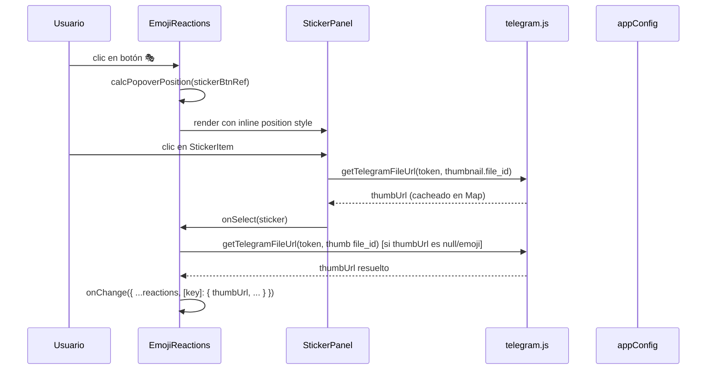
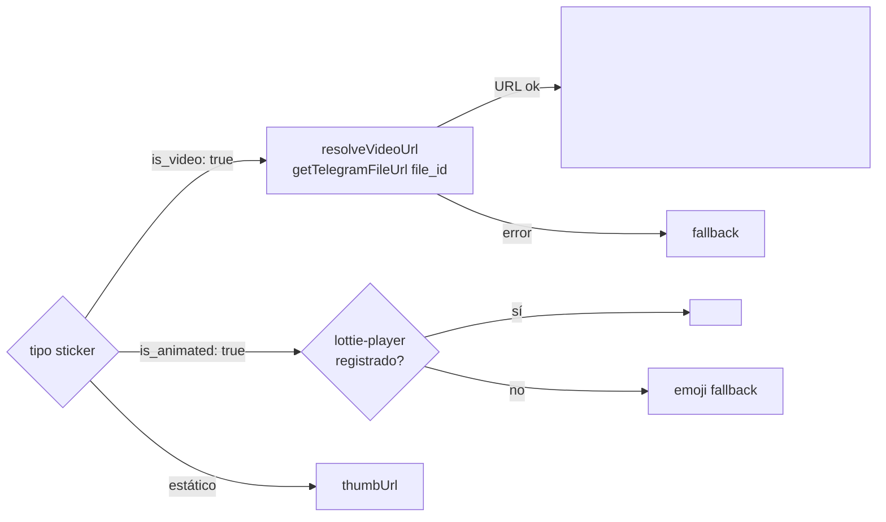
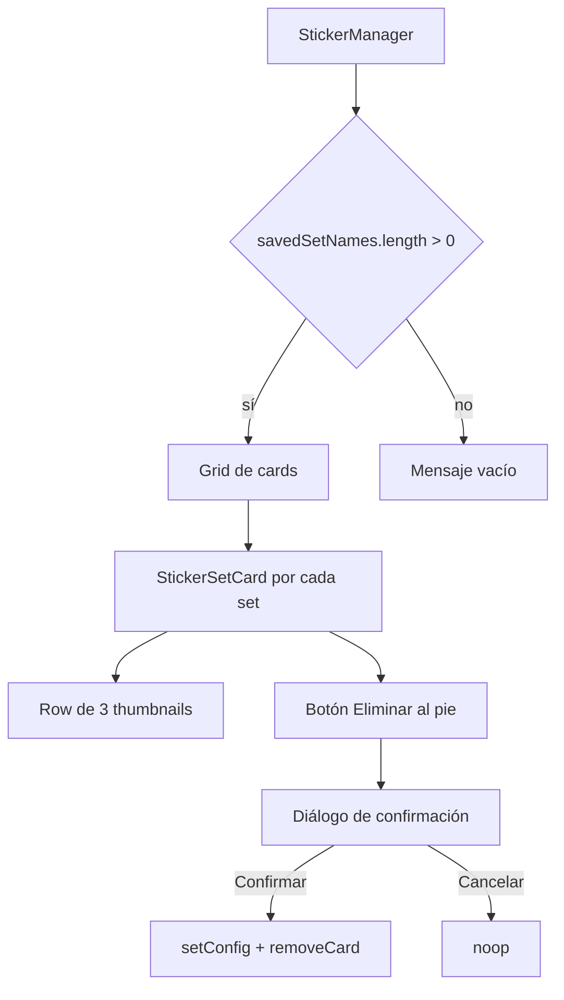

# Design Document — Sticker System Improvements

## Overview

Este documento describe el diseño técnico para las ocho mejoras al sistema de stickers de Telegram. Todas las modificaciones son evolutivas: no se introduce ninguna dependencia externa nueva salvo la verificación de `lottie-player` (ya opcionalmente disponible), y todos los cambios se mantienen dentro de los cuatro archivos afectados: `StickerPanel.jsx`, `EmojiReactions.jsx`, `global.css`, y la sección `TelegramStickerManager` de `ConnectionsPage.jsx`.

La arquitectura general del proyecto (React + Vite, sin estado global de UI fuera de `appConfig`) no cambia.

---

## Architecture

### Diagrama de componentes y flujo de datos

```mermaid
graph TD
    AC[appConfig.js<br/>localStorage 'app_config'] -->|getConfig / setConfig| SP[StickerPanel.jsx]
    AC -->|getConfig / setConfig| SM[StickerManager<br/>en ConnectionsPage.jsx]
    TG[telegram.js<br/>getTelegramFileUrl] -->|Thumbnail URL| SP
    TG -->|Thumbnail URL| ER[EmojiReactions.jsx]
    SP -->|onSelect(sticker)| ER
    ER -->|onChange(reactions)| Parent[Componente padre<br/>CommissionRow / TaskDetail]

    subgraph "Popover stack"
        ER -->|showStickers| SP
        ER -->|showPicker| EP[EmojiPicker.jsx]
    end

    subgraph "Posicionamiento"
        ER -->|getBoundingClientRect| POS[calcPopoverPosition()]
        POS -->|inlineStyle left/top/width| SP
    end
```

### Flujo de selección de sticker



---

## Components and Interfaces

### 1. `calcPopoverPosition(anchorRef, panelWidth?)` — nueva función utilitaria

Función pura que calcula el `style` objeto para posicionar un popover respecto a su ancla, sin solapar el sidebar.

```typescript
interface PopoverPosition {
  left: number        // px desde el borde izquierdo del viewport
  top?: number        // px desde el borde superior (modo normal)
  bottom?: number     // px desde el borde inferior del botón (modo invertido)
  width: number       // px de ancho efectivo del panel
  openUpward: boolean // true si el panel se abre hacia arriba
}

function calcPopoverPosition(
  anchorRef: React.RefObject<HTMLElement>,
  panelWidth: number = 320
): PopoverPosition
```

**Lógica:**
1. Obtiene `rect = anchorRef.current.getBoundingClientRect()`
2. `SIDEBAR_W = parseInt(getComputedStyle(document.documentElement).getPropertyValue('--sidebar-w')) || 230`
3. Si `window.innerWidth < 600` → `effectiveWidth = window.innerWidth * 0.95`; sino `effectiveWidth = panelWidth`
4. `rawLeft = rect.left`
5. `left = Math.max(rawLeft, SIDEBAR_W)` — clamping al sidebar
6. Si `left + effectiveWidth > window.innerWidth` → `left = window.innerWidth - effectiveWidth`
7. `left = Math.max(left, SIDEBAR_W)` — segunda pasada para casos extremos
8. `openUpward = (rect.bottom + 400 > window.innerHeight)`
9. Si `openUpward`: devuelve `{ left, bottom: window.innerHeight - rect.top, width: effectiveWidth, openUpward: true }`
10. Sino: devuelve `{ left, top: rect.bottom + 4, width: effectiveWidth, openUpward: false }`

Esta función se exporta desde un módulo utilitario inline o directamente en `EmojiReactions.jsx`.

---

### 2. `StickerPanel.jsx` — cambios por área

#### 2a. Visualización progresiva ("Ver más")

Se añade el estado `visibleCount` (inicializado a 5) que se resetea cuando cambia `activeSetName`.

```javascript
const [visibleCount, setVisibleCount] = useState(5)

// Reset al cambiar de tab
useEffect(() => {
  setVisibleCount(5)
}, [activeSetName])

const visibleStickers = activeStickers.slice(0, visibleCount)
const remaining = activeStickers.length - visibleCount
const showMore = remaining > 0
```

El botón "Ver más" incrementa en 10 o muestra todos los restantes si quedan ≤ 10:

```javascript
function handleShowMore() {
  setVisibleCount(prev => prev + 10)  // slice se encargará del límite natural
}
```

#### 2b. `StickerItem` — soporte para stickers animados

`StickerItem` se amplía para manejar tres tipos de renderizado según las propiedades del sticker:



Se agrega estado `videoUrl` y `videoError` adicionales al `imgError` existente.

El indicador `data-animated="true"` se aplica como atributo al wrapper del botón cuando `sticker.is_video || sticker.is_animated`.

#### 2c. Botón de eliminar en tabs — mover a StickerManager

El botón `×` dentro de los tabs de `StickerPanel` se mantiene para el contexto del popover, pero la función de administración principal se traslada a `StickerManager` en `ConnectionsPage.jsx` con confirmación explícita.

---

### 3. `EmojiReactions.jsx` — cambios por área

#### 3a. Posicionamiento del popover

Se reemplaza el `<div className="emoji-picker-popover">` estático por un `<div>` con `style` calculado:

```javascript
const [popoverStyle, setPopoverStyle] = useState({})

// Se recalcula al abrir
function handleOpenStickers() {
  setPopoverStyle(calcPopoverPosition(stickerBtnRef))
  setShowStickers(true)
}
```

El div del popover recibe `style={popoverStyle}` y pasa a tener `position: fixed` en lugar de `absolute`.

#### 3b. Resolución de thumbUrl en `onSelect`

La lógica actual construye la URL incorrectamente usando `sticker.thumb?.file_path` (que no viene en getStickerSet). Se reemplaza por una llamada `await getTelegramFileUrl`:

```javascript
onSelect={async (sticker) => {
  const key = '__sticker__' + sticker.file_unique_id
  const cfg = getTelegramConfig()
  const token = cfg?.token || ''

  // Resolver thumbnail correctamente
  const thumbFileId = sticker.thumbnail?.file_id ?? sticker.thumb?.file_id
  let thumbUrl = null
  if (token && thumbFileId) {
    thumbUrl = await getTelegramFileUrl(token, thumbFileId)
  }
  // Fallback si la API no responde
  if (!thumbUrl) thumbUrl = sticker.emoji || '🖼'

  onChange({
    ...reactions,
    [key]: {
      type: 'sticker',
      file_id: sticker.file_id,
      is_video: sticker.is_video ?? false,
      emoji: sticker.emoji,
      thumbUrl,
      count: (reactions[key]?.count || 0) + 1,
    }
  })
  setShowStickers(false)
}}
```

#### 3c. Renderizado de reaction chips con hover/delete

Se añade estado `hoveredKey` y `longPressKey` para controlar la visibilidad del botón `×`:

```javascript
const [hoveredKey, setHoveredKey] = useState(null)
const [longPressKey, setLongPressKey] = useState(null)
const longPressTimer = useRef(null)

function handleDeleteReaction(key) {
  const { [key]: _, ...rest } = reactions
  onChange(rest)
  setHoveredKey(null)
  setLongPressKey(null)
}
```

Para táctil, el `onTouchStart` inicia un `setTimeout` de 500ms que activa `longPressKey`. El `onTouchEnd/onTouchMove` cancela el timer.

#### 3d. Renderizado de video stickers en reaction chips

Cuando `val.is_video === true` y el thumbUrl es una URL válida (.webm), el chip renderiza `<video>` en lugar de ``:

```javascript
const isHttp = typeof thumbUrl === 'string' && thumbUrl.startsWith('http')
const isVideo = val.is_video && isHttp
```

---

### 4. `StickerManager` en `ConnectionsPage.jsx`

El StickerManager se rediseña con cards en lugar de tabs planos:



El botón eliminar usa `window.confirm()` como confirmación mínima (sincrona, accesible). No se introduce un modal React adicional para mantener la complejidad baja.

---

## Data Models

### Reaction Object (sticker)

```typescript
interface StickerReaction {
  type: 'sticker'
  file_id: string          // file_id de Telegram del sticker
  is_video: boolean        // true si es .webm animado
  emoji: string | null     // emoji asociado, fallback visual
  thumbUrl: string         // URL http válida o string emoji/glifo fallback
  count: number            // cuántas veces se ha reaccionado (≥ 1)
}
```

**Clave en el mapa de reacciones:** `__sticker__{file_unique_id}`

### appConfig — campo relevante

```typescript
interface AppConfig {
  telegramStickerSets: string[]   // lista ordenada de nombres de sets guardados
  sidebarWidth: number            // px, default 230
  // ... otros campos sin cambios
}
```

No se almacena ningún dato de los stickers en sí en `appConfig` ni en `localStorage`. Solo los nombres de sets se persisten. Los datos del set (título, array de stickers) viven únicamente en el estado `loadedSets` del `StickerPanel`, y se re-fetchen al montar o al cambiar de tab si no están en memoria.

### Estado interno de `StickerPanel`

```typescript
interface StickerPanelState {
  phase: 'IDLE' | 'LOADING' | 'LOADED' | 'ERROR'
  inputName: string
  errorMsg: string | null
  missingToken: boolean
  loadedSets: Record<string, { title: string; stickers: TelegramSticker[] }>
  activeSetName: string | null
  savedSetNames: string[]
  visibleCount: number      // NUEVO: límite progresivo
  focusedIndex: number
}
```

---

## Correctness Properties

*Una propiedad es una característica o comportamiento que debe cumplirse en todas las ejecuciones válidas del sistema — esencialmente, un enunciado formal sobre lo que el software debe hacer. Las propiedades sirven de puente entre especificaciones legibles por humanos y garantías de corrección verificables automáticamente.*

### Property 1: Persistencia round-trip de telegramStickerSets

*Para cualquier* array de nombres de sets (incluyendo el vacío), escribir ese array con `setConfig('telegramStickerSets', arr)` y leer inmediatamente con `getConfig().telegramStickerSets` debe devolver un array idénticamente igual (mismos elementos, mismo orden).

**Validates: Requirements 1.2, 1.3, 1.4**

---

### Property 2: Los tabs renderizados reflejan exactamente la lista guardada

*Para cualquier* array de `N` nombres únicos guardados en `appConfig.telegramStickerSets`, al montar `StickerPanel` el número de tabs renderizados debe ser exactamente `N`, y el texto de cada tab debe corresponder a uno de los nombres del array (o al título resuelto del set si está disponible).

**Validates: Requirements 1.1, 1.5**

---

### Property 3: Invariante de no-duplicados al agregar un set

*Para cualquier* lista existente de nombres y cualquier nombre nuevo (no presente en la lista), después de agregar ese nombre el array resultante debe tener exactamente `longitud_original + 1` elementos y el nombre debe aparecer exactamente una vez.

**Validates: Requirements 1.2**

---

### Property 4: Invariante de eliminación limpia

*Para cualquier* lista de nombres y cualquier nombre `n` en esa lista, después de eliminar `n` el array resultante debe: (a) no contener `n`, (b) tener `longitud_original - 1` elementos, (c) mantener el orden y contenido de todos los demás elementos sin cambios.

**Validates: Requirements 1.3, 4.2**

---

### Property 5: El posicionamiento nunca solapa el sidebar

*Para cualquier* posición de botón de anclaje dentro del viewport y cualquier ancho de viewport ≥ 320px, el borde izquierdo calculado del popover por `calcPopoverPosition()` debe ser siempre ≥ `SIDEBAR_W` (valor de `--sidebar-w`, default 230px).

**Validates: Requirements 2.1, 2.4**

---

### Property 6: El panel se invierte cuando hay poco espacio vertical

*Para cualquier* posición de botón de anclaje cuyo `rect.bottom + 400 > window.innerHeight`, `calcPopoverPosition()` debe devolver `openUpward: true`.

**Validates: Requirements 2.5**

---

### Property 7: El ancho se adapta a viewports pequeños

*Para cualquier* viewport con `window.innerWidth < 600`, `calcPopoverPosition()` debe devolver un ancho igual a `window.innerWidth * 0.95` (con una tolerancia de ±1px por redondeo).

**Validates: Requirements 2.3**

---

### Property 8: Sticker reactions se renderizan siempre como `` cuando thumbUrl es URL válida

*Para cualquier* mapa de reacciones que contenga al menos una clave con prefijo `__sticker__` cuyo `thumbUrl` comience con `http`, el componente `EmojiReactions` debe renderizar exactamente un elemento `` por cada una de esas claves, con `src` igual al `thumbUrl` almacenado.

**Validates: Requirements 3.1, 3.4, 3.5**

---

### Property 9: Stickers estáticos y de video usan elementos correctos

*Para cualquier* sticker con `is_video: true` y una URL `.webm` válida, `StickerItem` debe renderizar un elemento `<video>` con los atributos `autoPlay`, `loop`, `muted` y `playsInline`. *Para cualquier* sticker con `is_video: false`, debe renderizar un `` (o emoji fallback si no hay URL).

**Validates: Requirements 7.1, 7.5**

---

### Property 10: Indicador `data-animated` presente en todos los stickers animados

*Para cualquier* sticker con `is_video: true` o `is_animated: true`, el elemento raíz del item renderizado debe tener el atributo `data-animated="true"`.

**Validates: Requirements 7.4**

---

### Property 11: Visualización progresiva — límite inicial y reset

*Para cualquier* sticker set con `N > 5` stickers, al activar ese tab el número de stickers visibles debe ser exactamente 5. Al cambiar a cualquier otro tab y volver, el conteo debe reiniciarse a 5 independientemente de los clics previos en "Ver más".

**Validates: Requirements 5.2, 5.5**

---

### Property 12: Incremento correcto del "Ver más"

*Para cualquier* estado `(N_total, visibleCount)` donde `N_total - visibleCount > 0`, al hacer clic en "Ver más" el nuevo `visibleCount` debe ser `Math.min(visibleCount + 10, N_total)`. Si el nuevo `visibleCount === N_total`, el botón "Ver más" debe desaparecer.

**Validates: Requirements 5.3, 5.4, 5.7**

---

### Property 13: El botón `×` aparece al hacer hover y desaparece al salir

*Para cualquier* mapa de reacciones con al menos una clave `__sticker__`, activar el estado `hoveredKey` con esa clave debe cambiar la visibilidad/opacidad del botón `×` de ese chip a visible, y desactivar `hoveredKey` debe devolverla a oculta.

**Validates: Requirements 8.1, 8.3**

---

### Property 14: Eliminar una reacción produce un mapa sin esa clave

*Para cualquier* mapa de reacciones con `M` claves de sticker activas, hacer clic en `×` de cualquier clave debe llamar a `onChange` con un mapa que tenga exactamente `M - 1` claves de sticker activas, sin modificar ninguna otra clave.

**Validates: Requirements 8.2, 8.5**

---

### Property 15: Tamaños mínimos de sticker en CSS

*Para cualquier* elemento `` con clase `.sticker-reaction` renderizado en el DOM, sus dimensiones computadas deben ser `min-width ≥ 36px` y `min-height ≥ 36px`. *Para cualquier* elemento con clase `.sticker-item`, sus dimensiones computadas deben ser `min-width ≥ 72px` y `min-height ≥ 72px`.

**Validates: Requirements 6.1, 6.2, 6.3, 6.5**

---

## Error Handling

### Fallos de red en `fetchStickerSet`

- **Proxy no disponible** → fallback directo a la API de Telegram (ya implementado).
- **API devuelve `ok: false`** → mostrar `errorMsg` con mensaje diferenciado: "no encontrado" vs "error genérico".
- **Error de red (fetch throw)** → mostrar "Error de red al contactar Telegram."
- El estado `phase` vuelve a `'ERROR'` y el usuario puede reintentar cambiando el nombre del input y volviendo a pulsar "Agregar".

### Fallos de resolución de thumbUrl

- `getTelegramFileUrl` devuelve `null` si el token es inválido, el fileId no existe, o hay error de red.
- `StickerItem`: si `thumbUrl === null`, el componente muestra el emoji fallback del sticker o el glifo `🖼`.
- `EmojiReactions.onSelect`: si la resolución falla, se almacena `sticker.emoji || '🖼'` como `thumbUrl`. El sticker queda registrado con una representación visual degradada pero nunca se bloquea la acción del usuario.

### Fallos de carga de `<video>` (stickers animados)

- Se añade el estado `videoError` en `StickerItem`. Al dispararse el evento `error` del `<video>`, `videoError` se pone a `true` y el componente re-renderiza mostrando `` (thumbnail estático) o emoji fallback.
- No se muestra ningún elemento `role="alert"` ni mensaje de error visible al usuario; el degradado es silencioso.

### Token de Telegram no configurado

- Si `getTelegramConfig()` devuelve `null` o el token está vacío, `StickerPanel` muestra el mensaje de configuración y deshabilita todas las acciones.
- `EmojiReactions.onSelect` intenta resolver la URL pero, al fallar, aplica el fallback sin lanzar excepción.

### Confirmación antes de eliminar en StickerManager

- El botón "Eliminar" llama a `window.confirm('¿Eliminar el set «{nombre}»?')`.
- Si el usuario cancela, no se modifica `appConfig` ni el DOM.
- Si el usuario confirma, se llama `setConfig` y se actualiza el estado local sincrónicamente.

---

## Testing Strategy

### Enfoque dual: tests de ejemplo + tests de propiedad

Se usa **Vitest** (ya presente en el proyecto) como runner para ambos tipos de test.  
Para property-based testing se usa **fast-check** (compatible con Vitest, ligero, sin dependencias extra en producción).

```bash
npm install --save-dev fast-check
```

### Tests de propiedad (fast-check)

Cada propiedad del documento genera exactamente **un** test de propiedad configurado con mínimo **100 iteraciones** (`numRuns: 100`).

Etiqueta de referencia en comentarios: `// Feature: sticker-system-improvements, Property N: <título>`

Propiedades cubiertas por tests de propiedad:
- **Property 1** — round-trip `setConfig` / `getConfig`
- **Property 2** — tabs renderizados = lista guardada
- **Property 3** — no-duplicados al agregar
- **Property 4** — eliminación limpia
- **Property 5** — posicionamiento ≥ SIDEBAR_W
- **Property 6** — apertura hacia arriba
- **Property 7** — ancho adaptado a viewport < 600px
- **Property 8** — sticker reactions como ``
- **Property 9** — video vs img según is_video
- **Property 10** — data-animated en animados
- **Property 11** — visibleCount inicial y reset
- **Property 12** — incremento Ver más
- **Property 13** — hover muestra/oculta botón ×
- **Property 14** — eliminar reacción borra solo esa clave
- **Property 15** — tamaños mínimos CSS

### Tests de ejemplo (Vitest)

Para los criterios clasificados como EXAMPLE o SMOKE:

| Test | Criterio |
|---|---|
| Clic en tab sin datos en memoria llama fetchStickerSet | 1.6 |
| Imagen con onError muestra fallback | 3.3 |
| is_animated con lottie-player registrado renderiza `<lottie-player>` | 7.2a |
| is_animated sin lottie-player muestra emoji | 7.2b |
| Error de video muestra fallback estático | 7.3 |
| Confirmación cancelada no elimina set | 4.6a |
| Confirmación aceptada elimina set | 4.6b |
| Mensaje vacío cuando todos los sets eliminados | 4.4 |
| Botón eliminar siempre en el DOM | 4.5 |
| Long press 500ms muestra botón × | 8.4 |
| Botón × tiene área ≥ 20×20px | 8.6 |
| object-fit: contain en .sticker-item img | 6.4 |

### Tests de accesibilidad (smoke / manual)

- El botón eliminar en StickerManager tiene área mínima 32×32px y contraste ≥ 4.5:1 → verificar con DevTools / axe.
- Navegación por teclado del grid de stickers (ya implementada) → smoke test manual.

### Cobertura CSS (JSDOM / computed styles)

Para las properties 5, 7, 15 que verifican dimensiones y posicionamiento, se usa `@testing-library/react` + JSDOM con `getComputedStyle`. Para las propiedades CSS puras (6.1, 6.2, 6.4) se inyecta el stylesheet en el documento de test.

### Archivos de test

```
src/test/
  sticker-panel.property.test.jsx      # Properties 1–4, 11–12
  popover-position.property.test.js    # Properties 5–7
  emoji-reactions.property.test.jsx    # Properties 8, 13–15
  sticker-item.property.test.jsx       # Properties 9–10
  sticker-manager.example.test.jsx     # Tests de ejemplo de StickerManager (req 4)
  sticker-misc.example.test.jsx        # Tests de ejemplo varios (req 3.3, 7.2–7.3, 8.4, 8.6)
```
